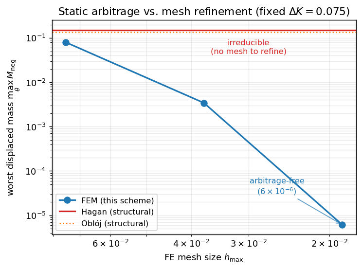
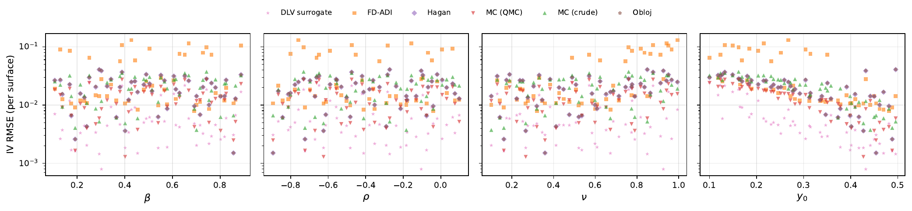
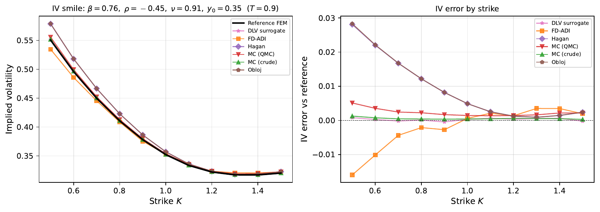
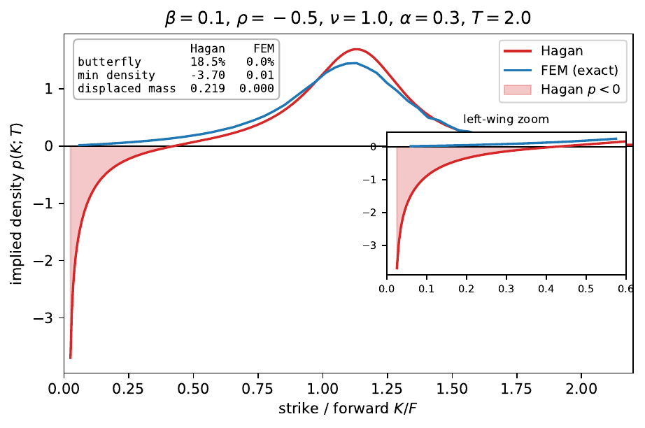
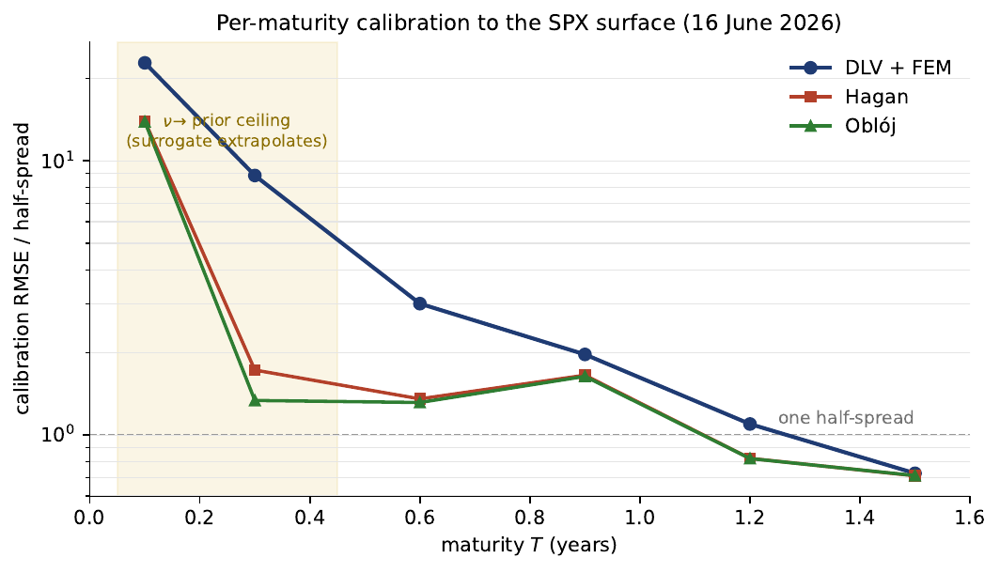

# sabrfem

A finite-element solver for the degenerate SABR pricing PDE, the classical and
grid-based methods it is benchmarked against, and a neural surrogate trained on
its output — so a full SABR surface can be priced at calibration speed while
keeping finite-element accuracy and staying arbitrage-free.

This is the code behind my MSc dissertation. Every pricing method exposes the
same `(params, strikes, maturities) -> surface` interface, so the finite-element
solver, the asymptotic formulas, Monte Carlo, finite differences and the neural
surrogate are all directly comparable on the same grid.

## The problem

The Hagan (2002) asymptotic formula is the market standard for SABR: it is a
closed form, so it is instant. But it is only an expansion — in the wings and at
short maturities the implied density it induces goes negative, i.e. it admits
butterfly arbitrage, so a surface quoted straight from it is not tradeable.

The honest alternative is to solve the pricing PDE. SABR's generator is
degenerate (the diffusion vanishes at the forward's zero boundary), which a
weighted-Sobolev finite-element scheme handles cleanly and, unlike the
asymptotics, converges to an arbitrage-free surface. The catch is cost: an FE
solve per parameter set is far too slow to sit inside a calibration loop.

So the thesis trains a small neural network on finite-element prices. Once
trained it prices a whole surface in microseconds — fast enough to calibrate —
while inheriting the FE solver's accuracy, and its residual arbitrage can be
repaired with a light projection layer. The finite-element method converges to
arbitrage-free where the asymptotics have an irreducible floor:



## What is in here

Every method prices on the same `strikes × maturities` grid under one convention
(forward measure, zero rate, undiscounted prices).

| Family        | Module                        | What it is                                             |
| ------------- | ----------------------------- | ------------------------------------------------------ |
| Finite element| `pricing.fem`                 | weighted-Sobolev FE scheme for the SABR PDE (the method) |
| Asymptotic    | `pricing.hagan`               | Hagan (2002) and Oblój implied-vol expansions          |
| Arbitrage-free| `pricing.hagan2014`           | Hagan–Kumar–Lesniewski–Woodward (2014) density PDE     |
| Monte Carlo   | `pricing.montecarlo`          | log-Euler MC with antithetic / control-variate + Sobol-QMC |
| Finite diff.  | `pricing.finite_diff`         | ADI / Craig–Sneyd two-dimensional scheme               |
| Surrogate     | `surrogate.{model,train,predict}` | HMT-style MLP trained on FE prices                 |

Around them:

- **`calibration`** — the inverse problem: fit SABR parameters to a quoted
  surface, using the surrogate as the forward map for the speedup.
- **`arbitrage`** — a butterfly-density scan (`hagan_scan`) and two arbitrage-free
  *repair* layers for a raw surrogate surface: a SANOS-style least-squares
  projection (`sanos`) and a QP projection (`qp`).
- **`eval`** — mesh-convergence studies (`convergence`) and the cross-method
  price/accuracy/runtime benchmark (`benchmarks`).
- **`metrics`** — every metric the thesis reports, one file each: the
  Breeden-Litzenberger `density`, `butterfly` static arbitrage (min density,
  displaced mass), `calendar` and `bounds` no-arbitrage checks, an `accuracy`
  summary (RMSE / MAE / percentile errors), `calibration` fit quality (weighted
  RMSE, RMSE in bid-ask spreads) and the FE `convergence` order. All pure NumPy.

```python
from sabrfem.metrics import butterfly_surface_stats, error_summary, estimate_order
stats = butterfly_surface_stats(call_prices, strikes)   # {'min_density', 'displaced_mass', ...}
acc   = error_summary(pred_iv, fe_iv)                    # {'rmse', 'mae', 'abs_p95', ...}
```

## Layout

```
sabrfem/
  black.py            Black-Scholes price / vega / put + implied-vol inversion
  pricing/            fem, hagan, hagan2014, montecarlo, finite_diff
  surrogate/          model (the MLP + input normalisation), train, predict
  calibration/        calibrate  (inverse problem, surrogate-accelerated)
  arbitrage/          hagan_scan, sanos, qp
  eval/               convergence, benchmarks
  metrics/            the thesis metrics, one file per metric
figures/              headline plots
README.md   requirements.txt   .gitignore
```

Heavy dependencies are imported lazily: `import sabrfem` and the light methods
(Hagan, Oblój, Black, the surrogate's `predict`) need only NumPy/SciPy. NGSolve
is required only for `pricing.fem`, PyTorch only for the surrogate.

## Running

```bash
python3 -m venv .venv && .venv/bin/pip install -r requirements.txt
```

```python
import numpy as np
from sabrfem.pricing import SABRParams, hagan_call_surface, mc_call_surface
from sabrfem.pricing import SABRSolver, FEConfig

p = SABRParams(beta=0.5, rho=-0.3, nu=1.0, y0=0.3, x0=1.0)
K, T = np.array([0.8, 0.9, 1.0, 1.1, 1.2]), np.array([0.5, 1.0])

hagan_px, hagan_iv = hagan_call_surface(p, K, T)          # instant asymptotic
fe_px, report = SABRSolver(p, FEConfig()).price_call_surface(K, T)   # FE reference
mc_px, mc_report = mc_call_surface(p, K, T)               # Monte Carlo cross-check
```

Command-line entry points (each is a module):

```bash
python -m sabrfem.eval.benchmarks           # FE vs MC / FD / Hagan, price + runtime
python -m sabrfem.eval.convergence          # FE mesh-convergence study
python -m sabrfem.arbitrage.hagan_scan      # butterfly-arbitrage scan of the asymptotics
python -m sabrfem.surrogate.train  --data data/training_data.npz   # train the surrogate
python -m sabrfem.calibration.calibrate     # calibrate to a surface
```

Predicting with a trained surrogate:

```python
from sabrfem.surrogate import load_surrogate, predict_ivs
model, cfg, torch = load_surrogate("data/nn/nn_model.pt")
iv = predict_ivs(model, cfg, [[0.5, -0.3, 1.0, 0.3]], strikes, maturities)
```

## Figures

Surrogate accuracy across the parameter prior (RMSE in vol points), and the
implied-vol surface from each method side by side:




Why the asymptotics are not enough — a Hagan (2002) surface with a negative
implied density (butterfly arbitrage), and a calibration to a market smile:




## Data

Training data is not included (the FE grids are large). Generate it with the
companion finite-element dataset generator, then point `sabrfem.surrogate.train`
at the resulting `.npz` (it expects `X`, `Y_price`, `Y_iv`, `W_vega`, `strikes`,
`maturities` and train/val/test index arrays). Trained checkpoints are not
included either; every non-neural method needs no training and runs as-is.
